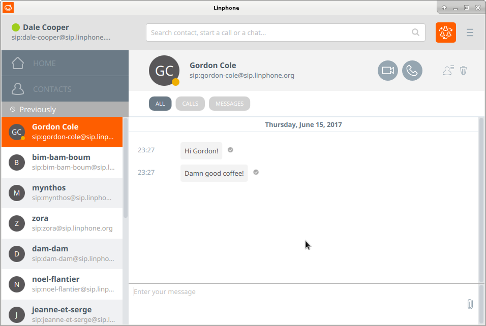

# Linphone Desktop

Linphone is a free VoIP and video softphone based on the SIP protocol.

## Getting started

Here are the general instructions to build linphone for desktop. The specific instructions for each build platform is described just below.

1. Install some build tools: `CMake`, `Python` and `Qt5` (_5.9 or newer_).
2. It's necessary to set the environment variable `Qt5_DIR` to point to the path containing the cmake folders of Qt5. Example:

        Qt5_DIR="~/Qt/5.9/gcc_64/lib/cmake"

3. The `PATH` environment variable must point to the Qt5 directory `bin`. Example:

        PATH="~/Qt/5.9/gcc_64/bin/:$PATH"

4. Prepare the build by running the `prepare.py` script.
5. Build the project using the appropriate build tool (`make`, `ninja`, `Xcode`, `Visual Studio (2013 or 2015 version)`).

### Specific instructions for the GNU/Linux and Mac OS X platforms

1. Prepare the build in a terminal by running the following command in the current directory:

        ./prepare.py

2. Build the project in a terminal with:

        make

### Specific instructions for the Windows platform

1. Ensure that you have downloaded the `Qt msvc2015 version` (32-bit). (64-bit version is not supported at this moment by Linphone Desktop.) `MinGW` must be installed too.

2. Define the `Qt5_DIR` and `PATH` environment variable to the Qt5 installation path:

        Qt5_DIR="C:\Qt\5.9\msvc2015\lib\cmake"
        PATH="C:\Qt\5.9\msvc2015\bin;%PATH%"

3. Open a Windows command line (cmd.exe) in the current directory and run:

        python prepare.py

4. Open the generated Visual Studio solution `Project.sln.lnk` and build it.

## Known bugs and issues

* __4K (High DPI Displays)__ If you encounter troubles with high DPI displays, it can be useful to set the `QT_AUTO_SCREEN_SCALE_FACTOR` environment variable to 1.

## Customizing your build

Some options can be given during the `prepare.py` step to customize the build. The basic usage of the `prepare.py` script is:

        ./prepare.py [options]

Here are the main options you can use.

### Building with debug symbols

Building with debug symbols is necessary if you want to be able to debug the application using some tools like GDB or the Visual Studio debugger. To do so, pass the `--debug` option to `prepare.py`:

        ./prepare.py --debug [other options]

### Generating an installation package (on Windows and Mac OS X platforms)

You might want to generate an installation package to ease the distribution of the application. To add the package generation step to the build just run:

        ./prepare.py --package [other options]

### Activate the build of all codecs

        ./prepare.py --all-codecs

### Using more advanced options

The `prepare.py` script is wrapper around CMake. Therefore you can give any CMake option to the `prepare.py` script.
To get a list of the options you can pass, you can run:

        ./prepare.py --list-cmake-variables

The options that enable you to configure what will be built are the ones beginning with `ENABLE_`. So for example, you might want to build linphone without the opus codec support. To do so use:

        ./prepare.py -DENABLE_OPUS=NO

## Updating your build

Simply re-building using the appropriate tool corresponding to your platform (make, Visual Studio...) should be sufficient to update the build (after having updated the source code via git).
However if the compilation fails, you may need to rebuild everything from scratch using:

        ./prepare.py -c && ./prepare.py [options]

Then you re-build as usual.

## License

GPLv2 © [Linphone](https://linphone.org)
